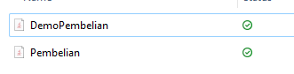
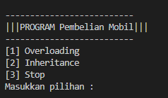
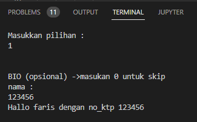

## CARA MEMBUAT METHOD OVERLOADING & METHOD INHERITANCE DI JAVA. </p>
<b> 1. Kita buat folder di dokumen. Disini saya kasih nama foldernya "Overloading_Inheritance". Untuk penamaan folder terserah kalian. </b> </p>

</p>

<b> 2. Langkah selanjutnya, di dalam folder buat 2 file. Kita kasih nama filenya: DemoPembelian.java dan Pembelian.java </b> </p>

</p>

<b> 3. Langkah selanjutnya, kita isikan programnya di file "DemoPembelian.java". Berikut codingannya: </b> </p>

```java
import java.util.Scanner;

public class DemoPembelian {

    public static void main(String[] args) {

        Scanner input = new Scanner(System.in);
        String nama;
        int no_ktp;

        int option = 0;
        do {
            menu();
            option = input.nextInt();

            switch (option) {
                case 1:
                    // // ----------- OVERLOADING ------------
                    System.out.println("\n");
                    System.out.println("BIO (opsional) ->masukan 0 untuk skip");

                    System.out.println("nama : ");
                    nama = input.next();
                    String namaR = nama;
                    System.out.println("No KTP : ");
                    no_ktp = input.nextInt();
                    int no_ktpR = no_ktp;

                    if ((namaR != "0") && (no_ktpR != 0)) {
                        Pembelian ouser = new Pembelian (namaR, no_ktpR);
                        ouser.bio();
                    } else {
                        Pembelian ouser = new Pembelian();
                        ouser.bio();
                    }
                    break;
                // // ------------------------------------

                case 2:
                    // ----------- INHERITANCE ------------
                    PembelianBin iuser = new PembelianBin();
                    iuser.setMobil();
                    System.out.println("\t");
                    iuser.setJenis();
                    System.out.println("\t");
                    iuser.setMerek();
                    iuser.collectingTrash();
                    iuser.ThrowOut();
                    break;
                // -----------------------------------------
                case 3:
                    System.out.println("Terimakasih telah memesan mobil...");
                    input.close();
                    break;

                default:
                    System.out.println("Invalid Input");
                    break;
            }
        }

        while (option != 3);

    }

    public static void menu() {
        System.out.println("\t");
        System.out.println("--------------------------");
        System.out.println("|||PROGRAM Pembelian Mobil|||");
        System.out.println("--------------------------");
        System.out.println("[1] Overloading");
        System.out.println("[2] Inheritance");
        System.out.println("[3] Stop");
        System.out.println("Masukkan pilihan : ");
    }

}

```
</p>

<b> 4. Langkah selanjutnya, kita isikan programnya di file "Pembelian.java". Berikut codingannya: </b></p>

```java

import java.util.Scanner;

// OVERLOADING
class Pembelian {
    public String nama;
    public int no_ktp;

    private String mobil;
    private String jenis;
    private String merek;
    private Scanner input;

    // ------- CONSTRUCTOR -------

    public Pembelian() {
        input = new Scanner(System.in);
        System.out.println("Memilih constructor kosong");
    }

    public Pembelian(String nama, int no_ktp) {
        input = new Scanner(System.in);
        this.nama = nama;
        this.no_ktp = no_ktp;
    }
    // -------- METHOD -----------

    public void setMobil() {
        System.out.println("Nama mobil yang ingin dibeli : ");
        this.mobil = input.next();
    }

    public void setJenis() {
        System.out.println("Jenis mobil : ");
        this.jenis = input.next();

    }

    public void setMerek() {
        System.out.println("Merek Mobil :\n[1] TOYOTA\n[2] HYUNDAI\n[3] DAIHATSU\n[4] HONDA\n[5] B5 ");
        System.out.println("=> pilih nomor");
        int choose = input.nextInt();

        if (choose == 1) {
            this.merek= "TOYOTA";

        } else if (choose == 2) {
            this.merek = "HYUNDAI";

        } else if (choose == 3) {
            this.merek = "DAIHATSU";

        } else if (choose == 4) {
            this.merek = "HONDA";

        } else if (choose == 5) {
            this.merek = "B5"; 
        
        } else {
            this.merek = " => Belum ada data";
        }

    }

    public String getMobil() {
        return this.mobil;
    }

    public String  getJenis() {
        return this.jenis;
    }

    public String getMerek() {
        return this.merek;
    }

    public void collectingTrash() {
        System.out.println("Mulai memilih merek mobil:  " + this.merek);
        System.out.println("-------------------------------");
    }

    public void bio() {
        System.out.println("Hallo " + this.nama + " dengan no_ktp " + this.no_ktp);
    }

}

// INHERITANCE
class PembelianBin extends Pembelian {

    private String warna;

    public void ThrowOut() {

        switch (getMerek()) {
            case "Toyota":
                this.warna = "merah";
                break;
            case "HYUNDAI":
                this.warna = "hitam";
                break;
            case "DAIHATSU":
                this.warna = "silver";
                break;
            
            case "HONDA":
                this.warna = "biru";
                break;    

            case "B4":
                this.warna = "lainnnya";
                break;
        }

        System.out.println(
                "Warna mobil yang dibeli " + warna + " > Memilih " + getMobil() + "Jenis: " + getJenis()
                        + " > pembelian berhasil.");
        System.out.println("\t");
    }
}

```
</p>

<b> 5. Setelah programnya diisi semua, langkah selanjunya kita RUN programnya di file "Pembelian.java". Setelah di RUN programnya maka akan keluar output seperti ini: </b> </p>

</p>

<b> Disini kita akan mencoba inputan "Overloading". Kalian cukup input angka "1" di outputnya, Maka hasilnya seperti ini: </b> </p>

</p>


